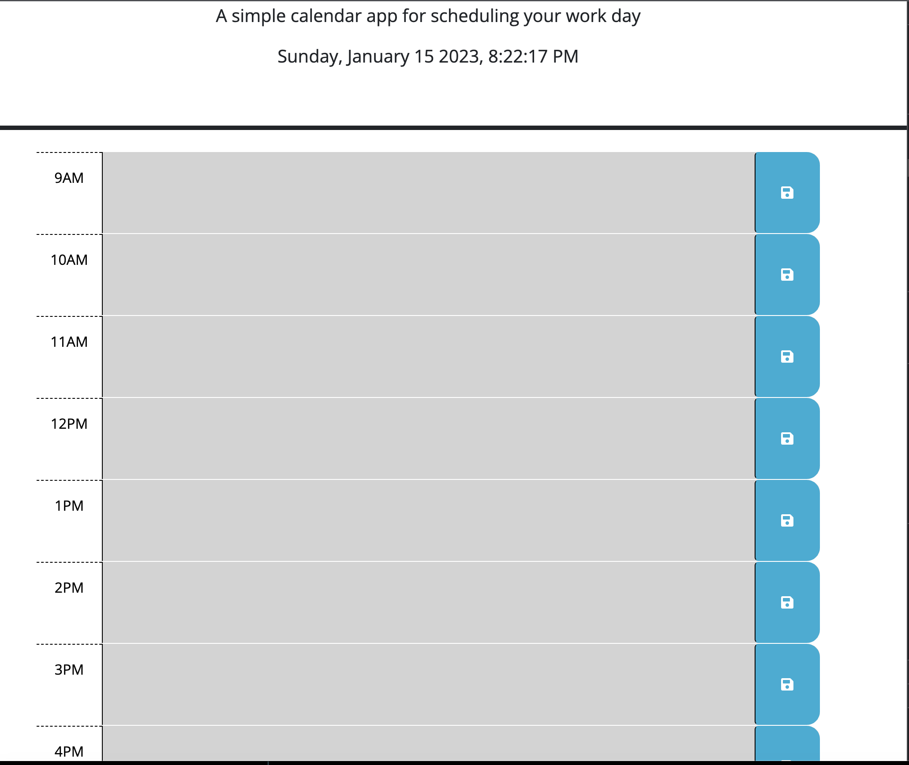

# Work Day Scheduler

## Description

Creating a work day schedule to practice using jquery.  Please feel free to visit at https://kyleoetjens.github.io/work_day_scheduler/

## Usage

Scheduler can be used to save events, todo items, meetings and more

    `
  
    

## Credits

Meg Meyers (coding bootcamp)
Dillon Riecke (class TA)
UMN coding bootcamp learning assistants

## Features

dynamic color coded time blocks
saving items to persist even on a page refresh

